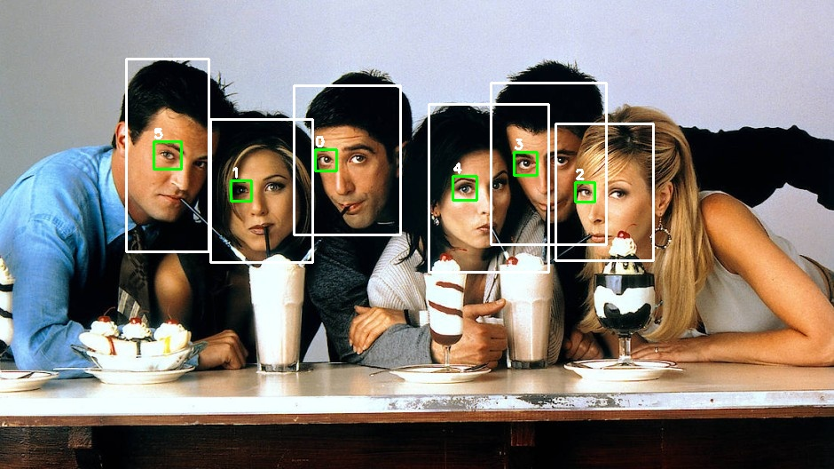

# Face_via_eye_detection

Here we use a eye-haar-cascader to recognize faces. This helps with mask covered faces. 

The medium article can be found here: **to be published**

Of course there are other ways to obtain this, but it might help someone some day. 

Stay save
